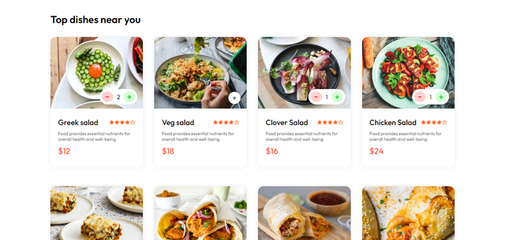
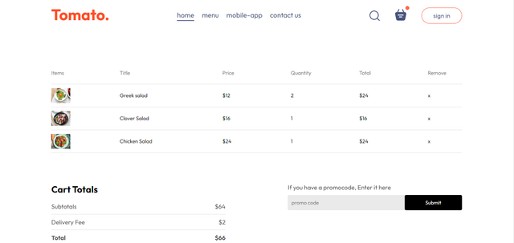
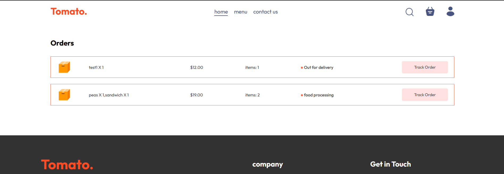
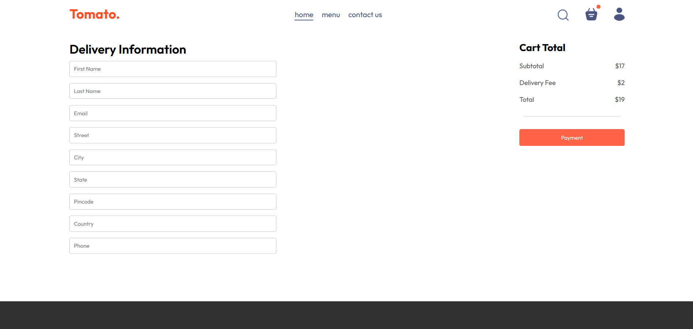
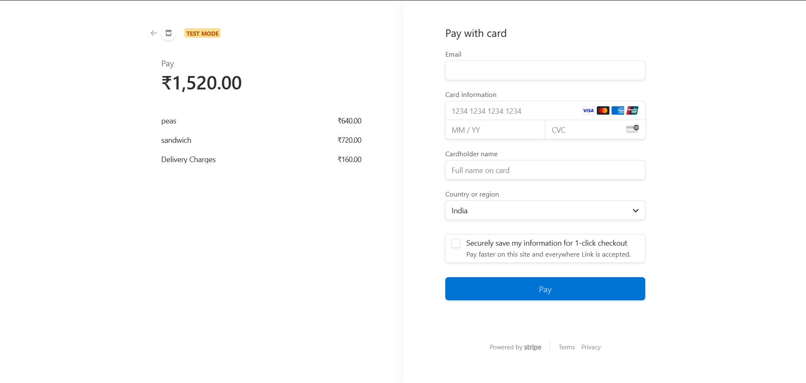
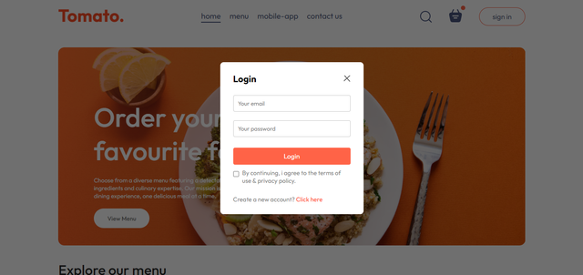
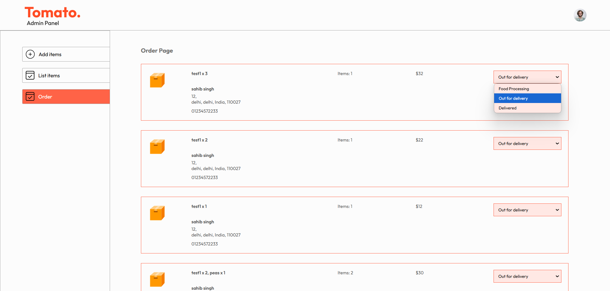
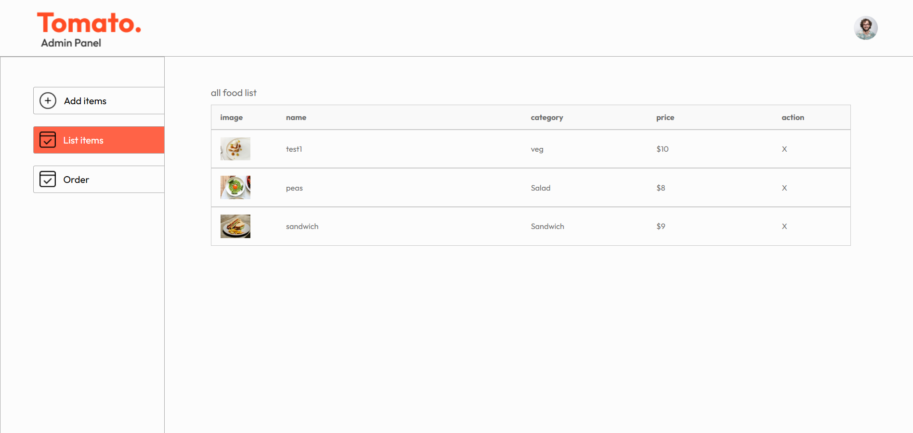

# 🍅 Tomato - Restaurant App

Tomato is a restaurant management app built using the **MERN (MongoDB, Express.js, React, Node.js) stack**.  
It allows users to browse menus, add items to a cart, make payments, and provides an admin panel for managing orders.

## 🚀 Features
- 🛒 **User Panel**: Browse menu, add items to cart, and place orders.
- 💳 **Payments**: Secure payment integration.
- 📊 **Admin Panel**: Manage orders and add new dishes.
- 🔍 **Search & Filters**: Find dishes easily.
- 🌐 **Responsive Design**: Works on mobile and desktop.

## 🛠️ Technologies Used
- **Frontend**: React.js, Redux, Tailwind CSS
- **Backend**: Node.js, Express.js
- **Database**: MongoDB
- **Authentication**: JWT
- **Payment Gateway**: Stripe (or any other)
---

## 🎯 Future Enhancements
📱 Mobile App version.
🛎️ Table booking system.
🎁 Discount & loyalty programs.

---
## 📧 Contact
For any queries, reach out at:
✉️ mansahibsinghgalshi@gmail.com

## 📸 Screenshots

### 🏠 Home Page


### 🍕 Menu Page


### 🛒 Cart Page


### 🛒 Myorders Page


### 🛒 Checkout Page


### 🛒 Payment Page


### 🛒 login Page



### 🛒 admin Page


### 🛒 add foods

### 🛒 All itmems



## 📦 Installation & Setup
### 1️⃣ Clone the Repository
```bash
git clone https://github.com/Mansahib/food-app.git
cd Tomato
  


##install dependency

npm install
cd client
npm install


